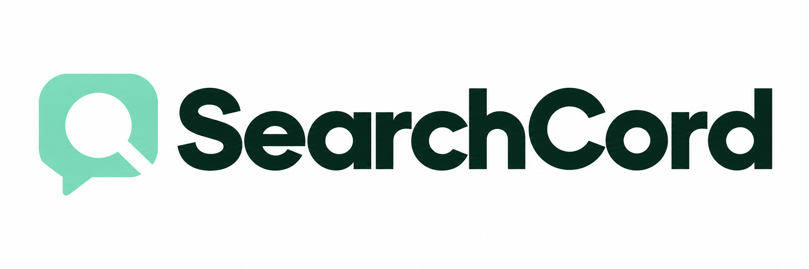

<p align="center">
  <picture>
    <source media="(prefers-color-scheme: dark)" srcset="static/brand/searchcord-logo-dark.png">
    
  </picture>
</p>

<p align="center">Archive Discord messages. Search them locally. Share a separate, read-only viewer.</p>

<p align="center">
  <a href="#get-started">Get started</a> ·
  <a href="#search-only">Search only</a> ·
  <a href="#your-data">Your data</a> ·
  <a href="#release-timeline">Release timeline</a>
</p>

| Workspace | What you can do |
| --- | --- |
| Browse | Search message text, filter by server, channel, author or date, and open saved profiles. |
| Scrape | Join servers, scan readable channels, pause/resume collection, monitor messages and save profiles. |
| Stats | Explore activity and contributors, then open the matching messages. |
| Search only | Run the viewer with an existing archive, without Discord credentials or collection controls. |

## Get started

Use **Python 3.12 or newer** with SQLite's FTS5 trigram support.
Collection requires a Discord token. Searching an existing archive does not.
Read the [use warning in the license](LICENSE) before collecting data.

```bash
git clone https://github.com/k0shir0/searchcord.git
cd searchcord
python -m venv .venv
```

Activate the environment:

```bash
# Linux / macOS
source .venv/bin/activate
```

```bat
:: Windows Command Prompt
.venv\Scripts\activate
```

Install and start:

```bash
python -m pip install -r requirements.txt
python app.py
```

Open <http://127.0.0.1:8000>. Windows users can also run `start.bat`.
A first upgrade of a large archive may take several minutes. The browser opens
when the database is ready.

Windows launchers discover `.venv`, then `venv`, then a working `py -3`, then
`python` on PATH. They run from their own repository directory, including paths
with spaces. Install dependencies into the selected interpreter with
`run-python.bat -m pip install -r requirements.txt`.

Both startup commands print a terminal-width-aware ASCII header. Supported
interactive terminals use green; redirected output, `TERM=dumb` and `NO_COLOR`
use plain text. The collector logs its save policy, request/retry intervals,
mandatory breaks and live polling interval once at startup. Saving happens after
each fetched page. Scrape requests wait a random 0.5–1 second after the previous
scrape response, with a 60-second break after every 100 successful responses.

The collector opens the operating system's default browser after its health
check succeeds. No browser executable paths are required. If launching fails,
the app keeps running and prints its URL for manual opening.

## Use SearchCord

1. Open the settings gear, name your Discord token and select **save & use token**.
2. Open **Scrape**, select **connect Discord**, then choose channels or direct messages.
3. Add conversations to the queue and select **start scraping**. Leave the message
   limit blank for full history. Later runs resume or collect newer messages.
4. Open **Browse** to search. Choose filter suggestions or paste Discord IDs.
   Date filters use UTC and include the selected end date.

Click a message author to open their saved profile. **Fetch expanded profiles**
saves missing profile details during collection; **backfill saved profiles**
collects details for authors already in the archive. Both can be stopped.

Scrape also accepts invite links or codes in a stoppable server-owned queue,
with join attempts at least 30 seconds apart. Double-click a server, press
**Shift+Enter**, or choose **scan & scrape** to queue readable channels and
accessible threads automatically. Automatic scans skip names containing `bot`;
those readable channels remain available for manual collection.

**Pause scraping** saves the current in-flight page before pausing. **Resume
scraping** continues the same job, channel, cursor and remaining message limit.
Reloading the page recovers the job while the server stays running. After a
server restart, re-queue its channels to continue from saved database cursors.
Request pacing and mandatory breaks are shared across scrape jobs and cannot
be bypassed by pause/resume or starting another job.
See [collection controls and limits](docs/collection.md) for the full behavior.

Search results load one page at a time. Collection retries temporary failures
and keeps saved messages when stopped. Message IDs prevent duplicate records.

Browse uses message-ID cursors to avoid counting every matching message. It shows
the current page and whether more results are available, rather than an exact
match total. Existing counted page links still work. Reloaded or shared cursor
links preserve their page; when earlier cursors are unavailable, **first page**
returns to the beginning. Queries accept up to 200 characters.

## Search only

Run the separate frontend in `static/search` with an existing SearchCord archive:

```bash
python search_app.py --db /path/to/archive.db
```

Open <http://127.0.0.1:8001>. You can also use
`--data-dir /path/to/folder` when the file is named `searchcord.db`.
Windows users can pass the same arguments to `start-search.bat`.
Without either option, the reader opens `data/searchcord.db`.

For a smaller file to deploy, export to a **new** destination:

```bash
python search_snapshot.py data/searchcord.db packed/searchcord.db
python search_app.py --data-dir packed --snapshot
```

The export preserves message text, names, timestamps, image links and saved
profiles. It excludes saved tokens and collection settings. After collecting
more data, export a new file and restart the viewer against it.
Use the original database for collection.

To prepare a standalone folder containing only the search service and its assets:

```bash
python deploy/search/package.py dist/searchcord-search
```

Copy that folder and your chosen database to the server. Follow the included
[deployment guide](deploy/search/README.md) to run the search-only viewer directly
with Python or build and run its Docker container. Both options serve existing
archives; scraping and archive administration use the Python collector (`app.py`).
The viewer needs a Python server; a static host cannot run it on its own.

## Your data

- The collector stores messages, profiles and saved tokens in `data/searchcord.db`.
  Tokens are stored in plaintext. Keep the database and its backups private.
- To change the collector's location, set `SEARCHCORD_DATA_DIR` before launching.
  The search service also accepts `SEARCHCORD_DB` for a specific file.
  Relative paths resolve against the application folder.
- Both apps start on loopback and have no built-in login. Put access control and
  HTTPS in front of a hosted viewer. Share only data you are entitled to share.
- Images remain on Discord. The database stores links, not image files.
  The collector can refresh expired links when your token still has access;
  the search-only viewer cannot.
- An older archive upgrade keeps a recovery backup. Allow extra disk space and
  check the upgraded archive before removing a backup.
- **Clear All Data** removes archived messages and derived metadata after
  confirmation. Saved tokens remain.
- **remove all saved tokens** deletes only `token`, `saved_tokens` and
  `active_token_id` from the configured database's `settings` table, after a
  second-click confirmation. Stop scrapes, DM cleanup and live monitors first;
  invite joining and profile backfill stop during removal. Messages and unrelated settings stay.
  Save a new token to connect again. Closing Settings cancels confirmation.

Token removal is logical deletion from the active database. Older recovery
backups and SQLite free/WAL pages may still contain credentials; this action
does not erase or delete those copies.

Recovery backups are named `searchcord.db.pre-compact-*.bak.gz` (or `.bak` if
compression fails) and contain the same private tokens and messages as the
source archive. Migration checks SQLite and full-text integrity. Fields already
discarded by an older migration can only be recovered from an original archive
or backup. Test upgrades on a separate copy first.

## Documentation

- [Collection, invites, scanning and pause/resume](docs/collection.md)
- [Saved profiles and backfill](docs/profiles.md)
- [Read-only search behavior](docs/search-display.md)
- [Standalone deployment](deploy/search/README.md)

The production branch contains the application, required assets, deployment
files, licenses and operating documentation. `.gitignore` explicitly lists the
allowed files. Keep local checks, benchmarks, review reports, experiments and
generated output ignored; add new production files to the allowlist before
committing them.

## Release timeline

Major development milestones in the current `main` history. Dates use
America/Chicago and reflect commits, not deployment dates. As of 2026-10-09,
no versioned [GitHub Releases](https://github.com/k0shir0/searchcord/releases)
have been published.

| Date | Update |
| --- | --- |
| 2026-10-09 | Invite queues, readable server/thread scans and reload-recoverable scrape pause/resume, with enforced request pacing and breaks. |
| 2026-10-07 | Portable Windows startup, terminal banner and saved-token removal. |
| 2026-10-02 | Faster cursor-based search and standalone viewer packaging with Docker support. |
| 2026-09-30 | Compressed search archives that exclude saved tokens. |
| 2026-09-29 | Immediate profile collection while scraping and stoppable, retryable profile backfill. |
| 2026-09-28 | Separate read-only viewer, archived profile cards and more reliable scraping. |
| 2026-09-26 | Multiple saved accounts, confirmed archive cleanup and expanded server/contributor rankings. |
| 2026-09-25 | Reduced archive storage and compressed recovery backups. |
| 2026-09-24 | Unified scraping tools and activity charts. |
| 2026-09-23 | New search layout, filters, resumable scraping and DM message cleanup. |
| 2026-07-23 | Unified web app with live monitoring and ChatML export. |
| 2025-09-20 | Initial scraper and viewer. |

## License

[MIT, with a wrongful use warning](LICENSE).
